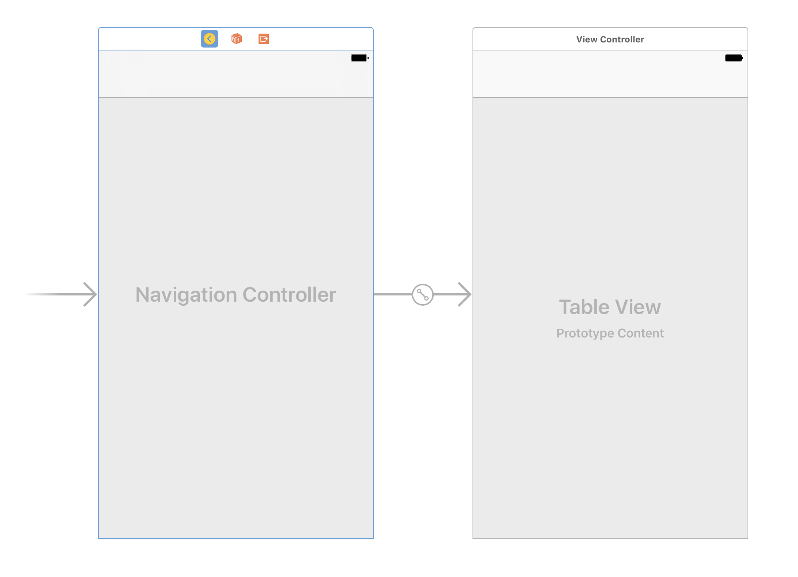

> 参考 [mixi-inc/iOSTraining 4.2 uitableviewとnavigationcontroller](https://github.com/mixi-inc/iOSTraining/wiki/4.2-uitableview%E3%81%A8navigationcontroller)

tableviewのセルを選択したときに、次の階層にpushさせてみましょう。  
3.1のプロジェクトファイルを引き続き利用します。

#### 事前準備 - NavigationControllerの追加 -

push, popの画面遷移を行うために、先ほどのview controllerをnavigation controllerの上に乗っけます。  
Initial View Controllerをnavigation controllerにして、rootViewControllerをview controllerにしてください。




## `deselectRow(at:animated:)`

UITableViewのあるセルが選択されると、delegateメソッドである`tableView(_:didSelectRowAt:)`が呼ばれます。
- このメソッドが呼ばれた時に、navigation controllerでpushできるようにしてみましょう。
- 新しく作るview controllerは新規でも既存のものでも構いません。

```swift
func tableView(_ tableView: UITableView, didSelectRowAt indexPath: IndexPath) {
    tableView.deselectRow(at: indexPath, animated: false)
    guard let viewController = storyboard?.instantiateViewController(withIdentifier: "ViewController") else {
        return
    }
    viewController.title = "\(indexPath.row)"
    navigationController?.pushViewController(viewController, animated: true)
}
```
