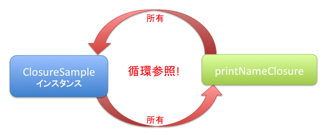

> 参考 [mixi-inc/iOSTraining 8.1 Blocks](https://github.com/mixi-inc/iOSTraining/wiki/8.1-Blocks)

Closureは通信完了後に実行したい、アニメーション完了後に実行したい、あるいは配列のソートを行う時の順序の判定として使いたい、などのように様々な箇所で用いることができます。この章では、このClosureの使い方と注意すべきポイントについて説明します。


# Closureの定義

### Closureの構文

Blocksの構文は以下のように書きます。

```swift
{ (引数の型,...) -> （返り値の型) in
    //処理
}
```

と書いても、分かりづらいのでいくつか例を紹介します。

```swift
// 基本的な使い方1
{ (a: Int) -> Bool in
    return a < 0
}

// 基本的な使い方2
{ (str: String) -> Int in
    return str.characters.count
}

// 返り値のないものも可能
{ (str: String) -> Void in
    print(str)
}

// 返り値がない場合は省略できる
{  (str: String) in
    print(str)
}

// 引数を取らない場合
{ () -> Int in
    return 10
}

// 返り値も引数もない場合
{ () -> () in
    print("closure")
}

// 引数も返り値も省略できる
{
    print("closure")
}
```

ちなみにこのコードは、コード中で`10`と書くようなもので意味はありません。

### 変数への代入と実行

Closure構文をClosure型として宣言された変数に代入することもできます。Closureの実行は関数と同じように実行することができます。

```swift
let c: (Int) -> Void // 戻り値がVoid型で引数としてInt型の変数を取るClosure型変数cの宣言

// c へ closureを代入
c = { (a: Int) -> Void in
    print(a)
}

c(10) // bに代入されたblockを実行


let c1: (Int, Int) -> Bool // 戻り値がBool型で引数として二つのInt型を取るClosure型変数c1の宣言
// closure構文を変数へ代入
c1 = { (x, y) -> Bool in
    return x < y
}

let result = c1(10, 20) // closure型変数c1を実行。resultにはtrueが入る。
```

また、関数の引数, 戻り値としても利用することができます。

```swift
let func1: ((Int) -> Int) -> () = { tmp in // 引数として利用
    _ = tmp(10)
}

// "Int型を引数としてとり、Double型"を返すClosure型を返り値として、Float型の引数aを取る関数func2の定義
let func2: (Float) -> ((Int) -> Double) = { a in
    return { (b) -> Double in
        return Double(a) + Double(b)
    }
}

// func2の使い方 //
let myClosure: (Int) -> Double = func2(10)  
let value = myClosure(20) // val = 10 + 20 が代入される
```

## typealiasを用いたClosureの型宣言

このClosure構文は複雑なため、ソースコードの可読性を下げてしまうなどの問題を引き起こしてしまいます。そのため、typealiasを用いて型宣言を行うことがよく行われます。

```swift
typealias 型の名前 = (引数の型,...) -> （返り値の型)
```

例えば上記func1の場合、

```swift
typealias Closure1Type = (Int) -> Int
```

とすることで

```swift
let func1: ((Int) -> Int) -> () = { tmp in // 引数として利用
    _ = tmp(10)
}
// ↓
let func1: (Closure1Type) -> () = { tmp in
    _ = tmp(10)
}
```

とすることができます。

func2の場合,

```swift
typealias Closure2Type = (Int) -> Double
```

とすることで、上記のコードは

```swift
let func2: (Float) -> Closure2Type = { a in
    return { (b) -> Double in
        return Double(a) + Double(b)
    }
}

// func2の使い方 //
let myClosure: Closure2Type = func2(10)
let value = myClosure(20) // val = 10 + 20 が代入される
```

と書き直すことができます。

# 変数の値をキャプチャ

変数の参照をキャプチャして取り込むことができます。

```swift
let a: Int = 10
let c1 = { print("a = \(a)") }
c1() // コンソールに a = 10 と表示される
```

structであっても変数の参照がキャプチャされます。

> Closures can capture and store references to any constants and variables from the context in which they are defined.  
参考 [The Swift Programming Language (Swift 3): Closures](https://developer.apple.com/library/content/documentation/Swift/Conceptual/Swift_Programming_Language/Closures.html)

例えば

```swift
var a: Int = 10

let c1 = {
    print("a = \(a)")
}
c1() // a = 10 と表示

a = 20
c1() // a = 20 と表示
```

このようにClosureオブジェクトを変数c1に代入した後にaの値を変化さると、Closure内の値も変化します。

```swift
var a: Int = 10

let c1 = { [a] in
    print("a = \(a)")
}
c1() // a = 10 と表示

a = 20
c1() // a = 10 と表示
```

aの値をClosureのCapture Listにすると、渡された値がキャプチャされます。

### Closure内でのオブジェクトの操作

キャプチャした変数の参照は、値を書き換えることができます。

```swift
var a: Int = 10
let c1 = {
    a = 20
    print("a = \(a)")
}
c1() // a = 20 と表示
print("a = \(a)") // a = 20 と表示
```

Capture Listに値を追加した場合は、値を書き換えることはできません。

```swift
var a: Int = 10
let c1 = { [a] in
    a = 20 // エラー
}
```

# Closureオブジェクトをプロパティとして持つ場合の注意点

あるクラスのプロパティとしてClosureオブジェクトを持たせることはありえると思います。例えばjob queueのクラスを作った際にタスクをClosureで記述する、何かのタスクの実行完了後の処理をClosureで記述する、などのことがあり得ると思います。

そのようなとき、Closureプロパティからselfを参照すると循環参照に陥る危険性があります。

例として、次のようなクラスを考えてみます。  
プロパティとしてnameと、シンプルなBlockオブジェクトを持ちます。  
実装を以下のようにしてみました。

```swift
class ClosureSample {
    var name: String = ""
    private(set) var printNameClosure: (() -> ())!

    init() {
        setup()
    }

    private func setup() {
        printNameClosure = {
            print("name = \(self.name)")
        }
    }
}
```

ClosureSampleクラスはstrongプロパティとしてprintNameClosureを持っていて、self.nameを出力するようにしています。   


Closureが変数をキャプチャするタイミングで、オブジェクトはClosureから所有されます。  


ClosureSampleのインスタンスがClosureを所有し、キャプチャのタイミングでClosureオブジェクトがインスタンスを所有するために循環参照が発生します。  


この循環参照を避けるためには、delegateメソッドパターンなどで用いられるように片方の参照をstrongからweakに変えてやればOKです。つまり、インスタンスとClosureのうち片方は所有し、もう片方は参照だけ持つ、という形にすればいいのです。
プロパティをweakにしてしまうと、スコープを抜けた時に解放されてしまうので、Closureからの参照を弱参照にします。

そのためには、weakまたはunownedを用いて弱参照のオブジェクトをClosureの中から参照するようにします。  

> 参考 [Swiftの循環参照問題におけるunownedとweakの使い分けについて](http://qiita.com/susieyy/items/f57f9362b8e0a89023cb)

```swift
printNameClosure = { [unowned self] in
    print("name = \(self.name)")
}
```

こうすることで、selfへの参照を弱参照にすることができ、循環参照を避けることができます。


※今回は説明の簡略化のために、Closureの確保される領域については説明を省略しました。より正しくこの循環参照の問題について知りたい場合はObjective-Cのものですがこちらの本をお勧めします。

http://tatsu-zine.com/books/objc

## 宿題として

SwiftのArrayにはfilterやmapなどが、filterをmyFilterとして実装してみましょう。

使用例

```swift
extension Array {
    func myfilter(_ isIncluded: (Element) -> Bool) -> [Element] {
        // ここを実装
    }
}

let before: [Any] = [ "hoge", "fuga", "piyo", 1, 2, 3, "foo", "bar"]
let after = before.myfilter { element in
    return element is String
}
print(after) // ["hoge", "fuga", "piyo", "foo", "bar"]
```
