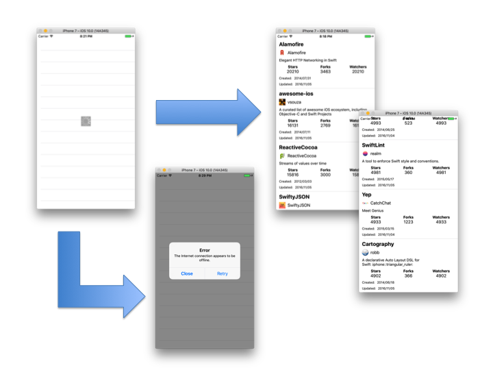

> 参考 [mixi-inc/iOSTraining 9.3 クラス設計演習](https://github.com/mixi-inc/iOSTraining/wiki/9.3-%E3%82%AF%E3%83%A9%E3%82%B9%E8%A8%AD%E8%A8%88%E6%BC%94%E7%BF%92)

**問題**

リモートから情報を取得し、その情報をもとに tableView を構成してください。

なお、実装の際には以下の点を考慮してください。

- データ URL -> [https://api.github.com/search/repositories?q=language%3Aswift&sort=stars](https://api.github.com/search/repositories?q=language%3Aswift&sort=stars)
- 動的に cell の高さを計算したり、cellの要素を設定するクラスを作成しましょう
- 通信を行っていることをユーザに明示しましょう。
- 通信が失敗した場合のエラーハンドリングとユーザへのフィードバックを行いましょう。

Cellに表示する要素は

- リポジトリ名 //"name"
- ユーザーアイコン //"owner" -> "avatar_url"
- ユーザー名 //"owner" -> "login"
- リポジトリ説明文 //"description"
- スター数 //"stargazers_count"
- フォーク数 //"forks_count"
- ウォッチ数 //"watchers_count"
- 作成日（余裕があれば） //"created_at"
- 更新日（余裕があれば） //"updated_at"

Alamofire、Kingfisher、SwiftyJSONなどを使っても良いです。
